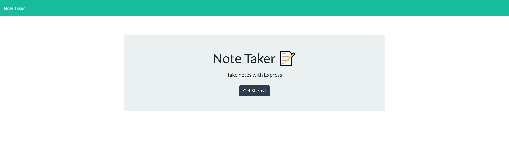
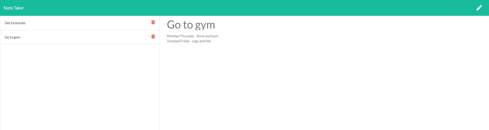

# Express.js Note Taker

  [](https://opensource.org/licenses/ISC)

  ## Description

  This is a note taking application that uses Express.js for server-side functionality. All data is kept within the application and notes can be removed individually with the delete button.

  ## Table of Contents

  * [Installation](##-installation)
  * [Usage](##-usage)
  * [License](##-license)
  * [Deployed Site Link](##-deployed-site-link)
  * [Questions](##-questions)
  * [Application Screenshots](##-application-screenshots)

  ## Installation

  To install the necessary dependencies, run the following command:
  ```
  npm i
  ```

  ## Usage

  This application could be useful for keeping notes for tasks or other things to remember.

  ## License

  This projects is licensed under the ISC license.

  ## Deployed Site Link

https://appfortakingnotes.herokuapp.com/
  ## Questions

  If you have any questions about the repo, open an issue or contact me directly at [aisthorpe@gmail.com](mailto:aisthorpe@gmail.com). You can find more of my work at [naisthorpe](https://www.github.com/naisthorpe).

  ## Site Screenshots

  ### Main Page
  

  ### Notes Page
  

